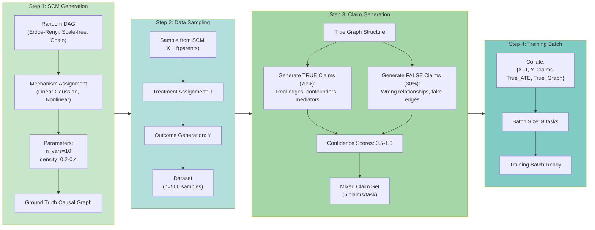

# PoG-PFN: Posterior-over-Graphs Prior-Fitted Network

A transformer-based architecture for causal effect estimation that performs amortized Bayesian updating over causal structures and differentiable causal identification.

## Core Innovation

PoG-PFN treats partial causal claims as a **probabilistic prior over causal structures**, uses data to compute a **posterior over structures**, then computes effects by **differentiable causal identification**—returning calibrated uncertainty when effects are not identifiable.

## Architecture

```mermaid
graph LR
    subgraph A["Module A: Dataset Encoder"]
        A1[Dataset X,T,Y] --> A2[Tokenizer]
        A2 --> A3[Positional Encoding]
        A3 --> A4[Transformer Encoder]
        A4 --> A5[Dataset Embedding + Variable Embeddings]
    end
    
    subgraph B["Module B: Claim Encoder"]
        B1["Causal Claims<br/>(70% true, 30% false)"] --> B2[Claim Tokenizer]
        B2 --> B3[Transformer]
        B3 --> B4[Cross-Attention with Variables]
        B4 --> B5[Claim Embeddings + Context]
    end
    
    subgraph C["Module C: Graph Posterior"]
        C1[Variable + Claim + Dataset Embeddings] --> C2[Edge Predictor]
        C2 --> C3[Acyclicity Constraint]
        C3 --> C4["Soft Adjacency Matrix<br/>(posterior over graphs)"]
    end
    
    subgraph D["Module D: Identification"]
        D1[Soft Adjacency + Variables] --> D2[Differentiable d-separation]
        D2 --> D3[Adjustment Set Distribution + Confidence]
    end
    
    subgraph E["Module E: Effect Estimator"]
        E1[Data + Adjustment Distribution] --> E2[Outcome Model]
        E1 --> E3[Propensity Model]
        E2 --> E4[Doubly Robust Estimator]
        E3 --> E4
        E4 --> E5["ATE mean ± std<br/>(with uncertainty)"]
    end
    
    A5 --> B
    A5 --> C
    B5 --> C
    C4 --> D
    D3 --> E
    
    style A fill:#e3f2fd
    style B fill:#f3e5f5
    style C fill:#fce4ec
    style D fill:#fff3e0
    style E fill:#e0f2f1
```



### Architecture Components

1. **PFN Dataset Encoder**: TabPFN-style transformer that encodes datasets and produces variable embeddings
2. **Claim Encoder**: Processes partial causal knowledge (constraints, relationships) into claim embeddings
3. **Graph Posterior Head**: Predicts soft adjacency matrices conditioned on data and claims
4. **Differentiable Identification Layer**: Computes adjustment set distributions via soft d-separation
5. **Effect Estimator**: Doubly robust ATE estimation with transformer-based nuisance models
6. **Uncertainty Quantification**: Returns ATE distributions with calibrated intervals

## Training Data Pipeline



### Data Generation Process

1. **SCM Generation**: Random DAG with configurable topology (Erdos-Renyi, Scale-free, Chain)
2. **Data Sampling**: Sample n=500 observations from structural causal model
3. **Claim Generation**: Mix 70% true + 30% false claims about relationships
4. **Training Batch**: Collate {X, T, Y, Claims, Ground Truth} for supervised learning

## Key Advantages

- **Graceful degradation**: Wrong or unidentifiable claims lead to wider uncertainty, not wrong point estimates
- **Claim validation as Bayesian updating**: No separate "trust head"—validation is implicit in posterior shift
- **Identifiability-aware**: Model learns when to be uncertain based on structural ambiguity
- **Transformer-first**: End-to-end differentiable, amortized inference over causal structures

## Project Structure

```
pog_pfn/
├── models/
│   ├── dataset_encoder.py    # Module A: PFN-style dataset encoder
│   ├── claim_encoder.py       # Module B: Claim tokenization & transformer
│   ├── graph_posterior.py     # Module C: Soft adjacency prediction
│   ├── identification.py      # Module D: Differentiable d-separation
│   ├── effect_estimator.py    # Module E: DR-ATE with transformers
│   └── pog_pfn.py            # Full end-to-end model
├── data/
│   ├── scm_generator.py       # Realistic SCM generation
│   ├── claim_generator.py     # Claim sampling strategies
│   └── dataset.py             # PyTorch Dataset wrapper
├── training/
│   ├── losses.py              # Multi-objective loss functions
│   ├── trainer.py             # Training loop
│   └── metrics.py             # Evaluation metrics
├── evaluation/
│   ├── synthetic_eval.py      # Synthetic benchmarks
│   ├── semisynthetic_eval.py  # IHDP/LaLonde
│   └── baselines.py           # Do-PFN, CausalPFN, etc.
├── configs/
│   └── default.yaml           # Hyperparameters
├── scripts/
│   ├── train.py               # Main training script
│   └── evaluate.py            # Evaluation script
└── notebooks/
    └── visualization.ipynb    # Results visualization
```

## Installation

```bash
# Create environment
conda create -n pog-pfn python=3.10
conda activate pog-pfn

# Install dependencies
pip install torch numpy scipy pandas scikit-learn
pip install networkx graphviz pydot
pip install matplotlib seaborn plotly
pip install pyyaml tqdm wandb
```

## Usage

```python
from pog_pfn import PoGPFN

# Initialize model
model = PoGPFN(
    n_vars=20,
    d_model=256,
    n_heads=8,
    n_layers=6
)

# Train
model.fit(datasets, claims, true_ates, true_graphs)

# Predict with uncertainty
ate_mean, ate_std, graph_posterior = model.predict(
    dataset, 
    claims,
    return_uncertainty=True
)
```

## Key References

1. **TabPFN**: [arXiv:2207.01848](https://arxiv.org/abs/2207.01848)
2. **Do-PFN**: [arXiv:2506.06039](https://arxiv.org/abs/2506.06039)
3. **ACTIVA**: [arXiv:2503.01290](https://arxiv.org/html/2503.01290v2)
4. **CausalPFN**: [OpenReview](https://openreview.net/forum?id=4ORSXgZTWn)

## License

MIT
